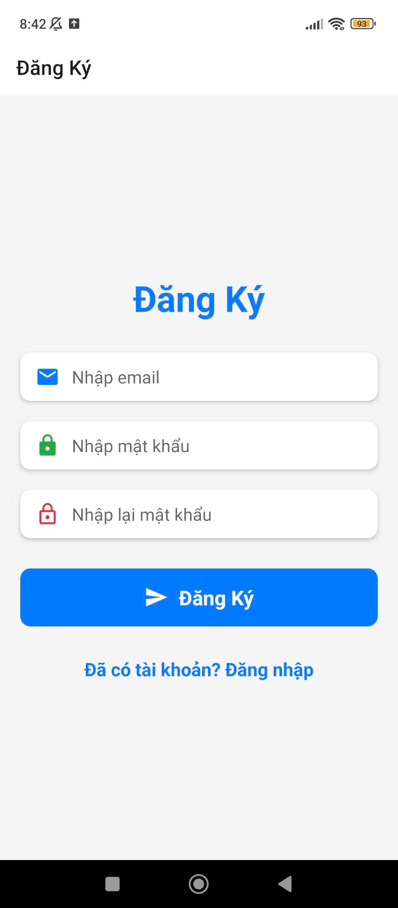

# Nhom3_AppMobileStore
## 1. Thành viên nhóm 3:
+ Trần Khải Hoàn - 21110827
+ Phạm Ngọc Đăng Khoa - 21110214
## 2. Đề tài: Ứng dụng bán thiết bị di động
## 3. Đặc tả use case:
- Use case 1: Đăng nhập
+ Actor: User.
+ Post Condition: User đăng nhập thành công vào ứng dụng.
+ Main Flow:
  1. Tại trang Đăng nhập, User nhập các thông tin vào các trường để Đăng nhập bao gồm: Email, Mật khẩu và nhấn nút "ĐĂNG NHẬP".
  2. Hệ thống kiểm tra thông tin đăng nhập của User.
  3. Hệ thống chuyển User qua trang chủ.
+ Alternate Flow:
  1.1. User có thể nhấn vào chữ "Quên mật khẩu".
  2.1. Hệ thống chuyển User qua trang Quên mật khẩu.
  1.2. User có thể nhấn vào chữ "Chưa có tài khoản? Đăng ký".
  2.2. Hệ thống chuyển User qua trang Đăng ký.
+ Exception Flow:
  2.1. Thông tin nhập không hợp lệ.
  3.2. Hệ thống hiện thông báo Đăng nhập thất bại và yêu cầu User nhập lại.
- Use case 2: Đăng ký:
+ Actor: User.
+ Post Condition: User đăng ký tài khoản thành công.
+ Main Flow:
  1. Tại trang Đăng ký, User nhập các thông tin vào các trường để Đăng ký bao gồm: Email, Mật khẩu, Nhập lại mật khẩu và nhấn nút "Đăng Ký".
  2. Hệ thống kiểm tra thông tin đăng ký của User.
  3. Hệ thống gửi mã OTP 6 chữ số qua Email đã nhập ở bước 1 và hiển thị thông báo "Mã OTP đã được gửi".
  4. Tại trang nhập OTP, User nhập mã OTP và nhấn nút "Xác nhận".
  5. Hệ thống kiểm tra mã OTP đã nhập.
  6. Hệ thống thông báo "Đăng ký thành công", chuyển User qua trang Đăng nhập và lưu thông tin tài khoản vào cơ sở dữ liệu.
+ Alternate Flow: N/A
+ Exception Flow: N/A
- Use case 3: Quên mật khẩu
+ Actor: User.
+ Post Condition: User đổi mật khẩu thành công.
+ Main Flow:
  1. Tại trang Quên mật khẩu, User nhập Email và nhấn nút "Gửi OTP".
  2. Hệ thống kiểm tra Email đã nhập.
  3. Hệ thống gửi mã OTP 6 chữ số qua Email đã nhập ở bước 1 và hiển thị thông báo "Mã OTP đã được gửi".
  4. Tại trang Đặt lại mật khẩu, User nhập mã OTP và nhấn nút "Đặt lại mật khẩu".
  5. Hệ thống kiểm tra mã OTP đã nhập.
  6. Hệ thống gửi Email đặt lại mật khẩu thông báo "Đã gửi email đặt lại mật khẩu".
  7. User truy cập vào trang Đổi mật khẩu thông qua link được gửi qua Email.
  8. Tại trang Đổi mật khẩu, User nhập mật khẩu mới và nhấn "Save".
  9. Hệ thống kiểm tra mật khẩu đã nhập.
  10. Hệ thống thông báo đổi mật khẩu thành công và lưu thông tin tài khoản vào cơ sở dữ liệu.
+ Alternate Flow: N/A
+ Exception Flow: N/A
- Use case 4: Cập nhật thông tin
+ Actor: User.
+ Post Condition: User cập nhật thông tin cá nhân thành công.
+ Main Flow:
  1. Tại trang Cập nhật thông tin cá nhân, User có thể thay đổi ảnh đại hiện và nhập các thông tin vào các trường bao gồm: Tên người dùng, Ngày sinh, Số điện thoại, Địa chỉ và nhấn nút "Cập nhật thông tin cá nhân".
  2. Hệ thống hiện thị thông báo xác nhận, User bấm "Lưu".
  3. Hệ thống chuyển User qua trang xác nhận cập nhật và gửi mã OTP qua email User đã đăng ký.
  4. User nhập mã OTP đã gửi và nhấn nút "Xác nhận OTP"
  5. Hệ thống thông báo cập nhật thông tin cá nhân thành công và lưu thông tin cá nhân vào cơ sở dữ liệu.
- Use case 5: Xem chi tiết sản phẩm
+ Actor: User.
+ Post Condition: User xem chi tiết sản phẩm thành công.
+ Main Flow:
   1. Tại trang chủ, User nhấn vào sản phẩm muốn xem thông tin chi tiết.
   2. Hệ thống chuyển User qua trang xem thông tin chi tiết sản phẩm đó.
   3. User xem thông tin chi tiết sản phẩm.
- Use case 6: Tìm kiếm sản phẩm
+ Actor: User.
+ Post Condition: User tìm kiếm sản phẩm thành công.
+ Main Flow:
   1. Tại trang chủ, User nhập tên sản phẩm muốn tìm kiếm.
   2. Hệ thống hiển thị những sản phẩm có tên giống với tên đã nhập.
- Use case 7: Lọc sản phẩm
+ Actor: User.
+ Post Condition: User lọc sản phẩm thành công.
+ Main Flow:
   1. Tại trang chủ, User nhấn vào icon "☰".
   2. Hệ thống chuyển User qua trang lọc sản phẩm.
   3. User có thể chọn các danh mục, thương hiệu muốn tìm kiếm hoặc cũng có thể chọn "Giá: Thấp đến Cao" hoặc "Giá: Cao đến Thấp" để lọc theo giá và bấm "Xong".
   4. Hệ thống hiển thị những sản phẩm theo bộ lọc.
## 4. Hình các giao diện:
- Trang đăng ký:

- Trang đăng nhập:

- Trang quên mật khẩu:

- Trang chủ:

- Trang cập nhật thông tin cá nhân:

- Trang xem chi tiết sản phẩm:

- Trang lọc:

- Trang chủ Admin:

- 
